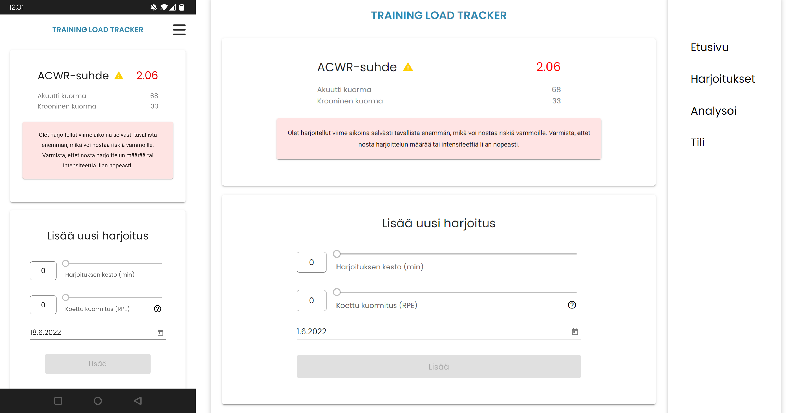
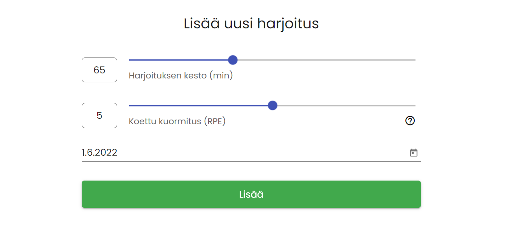
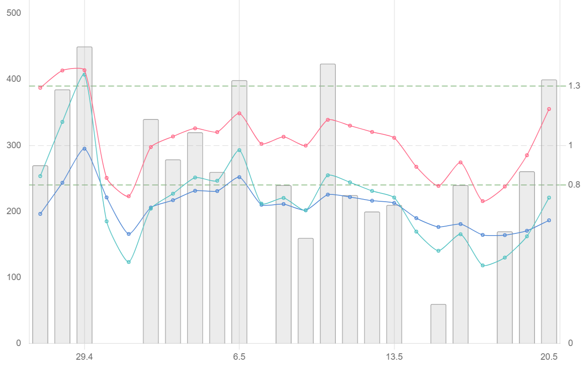

# TrainingLoadTrackerWebApp
> A web application for tracking RPE-based training load

***
**The application is published as Azure App Service and you can find it** [**here**](https://tloadtracker.azurewebsites.net/)
***

## About

The application is desgined as **mobile first**, but works as well in larger screens.
###

It is targeted for individuals that are interested in **tracking the physical training load** of their training sessions.
###

Its goal is to be **effortless to use** in daily life and provide **intuitive visual view of current status and history** of training load.
###

This application was developed as a part of studies at TAMK.
